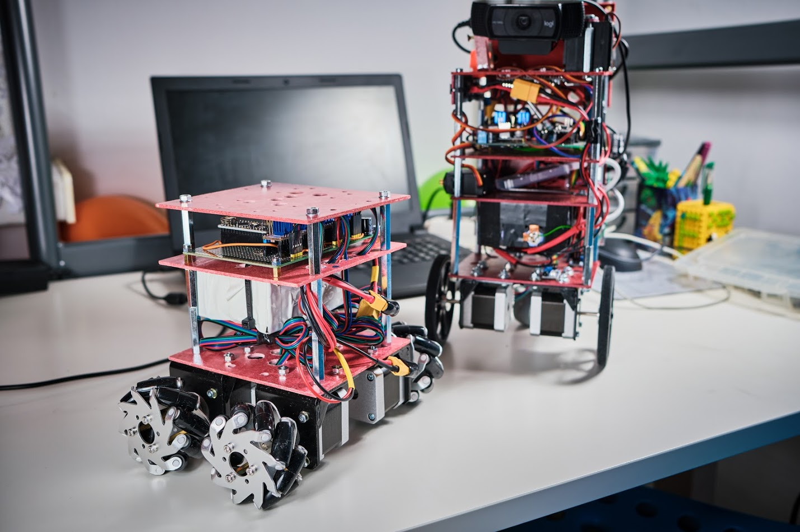
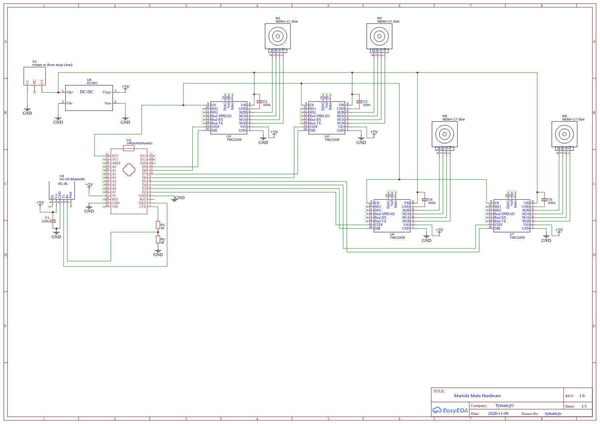

# Mariola
A wheel robot using mecanum wheels based on arduino as main driving platform.

## Overview

## Electrical Scheme

## Bil of Material 
- 4 Nema17 size 17HS4401 stepper motors
- 4 Mecanum wheels 65mm size / 5mm rod
- 4 SilentStep divers TMC2209
- 1 Arduino Nano 
- 1 DC/DC step down converter
- 1 BT 4.0 Module HM-10 CC2541
- 4 electrolytic capacitors (100uF/25V)
- Battery pack 4S2P LiIon based on 18650 cells

## Arduino code
The arduino code was made using the vscode with PlatformIO addon. And is available in this repository. 

It's using serial received data (which are transferred by BT, but might be just done via regular UART) that are following the command syntax:

_<1,W1,W2,W3,W4,Spd>_

where:
- W1 - distance for wheel 1 (right back) in cm
- W2 - distance for wheel 2 (right front) in cm
- W3 - distance for wheel 3 (left back) in cm
- W4 - distance for wheel 4 (left front) in cm
- Spd - speed (limited to 4000)

>This doc is under preparation. More to come...

